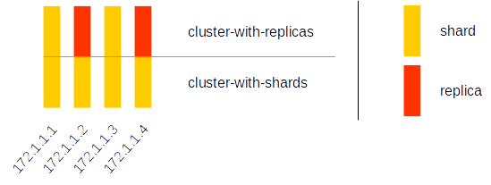

# Ansible Role - ClickHouse Server for Docker
[](https://travis-ci.org/searchmetrics/ansible-role-docker-clickhouse) [](https://galaxy.ansible.com/searchmetrics/ansible-role-docker-clickhouse/)

An ansible role to start and run a ClickHouse server docker container. 
You can change any server config setting for example:
- ClickHouse server version
- listen host (bind address)
- ports
- user profiles
- user password 
- user quotas
- remote server (ClickHouse cluster)
- zookeeper host
- macros

## Requirements
This role requires Ansible 2.0 or higher.

## Role Variables

host & docker vars
```yml
# host
clickhouse_docker_host_data_folder: "/docker/clickhouse-data"
clickhouse_docker_host_config_folder: "/docker/clickhouse-config"
clickhouse_docker_host_task_queue_folder: "/docker/clickhouse-task-queue"

# docker
clickhouse_docker_version: latest
clickhouse_docker_network_mode: host
clickhouse_docker_container_name: clickhouse
clickhouse_docker_bind_mounts:
  - "{{clickhouse_docker_host_data_folder}}:/var/lib/clickhouse"
  - "{{clickhouse_docker_host_config_folder}}:/etc/clickhouse-server/conf.d"
  - "{{clickhouse_docker_host_task_queue_folder}}:/clickhouse/task_queue"
```

ClickHouse server settings
```yml
clickhouse_docker_config:
  listen_host:  127.0.0.1
  http_port:    8123
  tcp_port:     9000

clickhouse_docker_config_resharding:
  - /clickhouse/task_queue

clickhouse_docker_config_distributed_ddl:
  - /clickhouse/task_queue/ddl
```  
  
ClickHouse user profiles
```yml
# ------------------------ 
# default user settings:
#   networks: 
#       - <ip>::/0</ip>
#   profile: default
#   quota:   default
# ------------------------
clickhouse_docker_users:
  default:
    password: test
  ro_user:
    password: test
    profile: readonly  

clickhouse_docker_user_profiles:
  - readonly:
    - readonly: 1
```

## Example Playbook
#####Server with default config.
```yml
- hosts: localhost
  become: yes
  roles:
    - ansible-role-docker-clickhouse
```

#####Server with custom config:
- ClickHouse server version
- HTTP & TCP ports
- listen_host (bind address)
```yml
- hosts: localhost
  become: yes
  vars:
    - clickhouse_docker_version: 1.1.54304
    - clickhouse_docker_config:
        http_port:    8124
        tcp_port:     9001
        listen_host:  0.0.0.0
  roles:
    - ansible-role-docker-clickhouse
```

#####Server with custom users & profiles:
- Set a password for default ClickHouse user.
- Define a read-only ClickHouse user "ro_user" with empty password, profile, quota and network. 
```yml
- hosts: localhost
  become: yes
  vars:
    - clickhouse_docker_user_profiles:
        default:
          max_memory_usage:     10000000000
          max_execution_time:   60
          max_rows_to_read:     1000000000
          max_result_rows:      1000000000
        readonly:
          readonly: 1
    - clickhouse_docker_users:
        default:
          password: root
        ro_user:
          password: ""
          profile: readonly
          quota: ro_user_quotas
          networks:
            - "<ip>::1</ip>"
            - "<ip>127.0.0.1</ip>"
            - "<ip>127.0.0.1/32</ip>"
            - "<host>localhost</host>"
  roles:
    - ansible-role-docker-clickhouse
```

#####Server with remote server config.

In the following example you can find a remote server definition with 2 cluster. 
One alled "cluster-with-replicas" with 2 shard and 2 replica (1 replica per shard) 
and another cluster called "cluster-with-shards" with 4 shards no replication.



```yml
- hosts: localhost
  remote_user: root
  vars:
    - clickhouse_docker_config:
        http_port:    8123
        tcp_port:     9000
    - clickhouse_docker_remote_servers:
        cluster-with-replicas:
          - shard:
              replica:
                - { host: 172.1.1.1, port: 9000 }
                - { host: 172.1.1.2, port: 9000 }
          - shard:
              replica:
                - { host: 172.1.1.3, port: 9000 }
                - { host: 172.1.1.4, port: 9000 }    
        cluster-with-shards:
          - shard: { replica: [ { host: 172.1.1.1, port: 9000 } ] }
          - shard: { replica: [ { host: 172.1.1.2, port: 9000 } ] }
          - shard: { replica: [ { host: 172.1.1.3, port: 9000 } ] }
          - shard: { replica: [ { host: 172.1.1.4, port: 9000 } ] }
  roles:
    - ansible-role-docker-clickhouse                

```

#####Server with ZooKeeper hosts config.

```yml
- hosts: localhost
  remote_user: root
  vars:
    - clickhouse_docker_zookeeper_hosts:
        - { index: 1, ip: 172.1.1.11, port: 2181 }
        - { index: 2, ip: 172.1.1.12, port: 2181 }
        - { index: 3, ip: 172.1.1.13, port: 2181 }
  roles:
    - ansible-role-docker-clickhouse        
```

XML file in the docker container:\
$docker exec clickhouse-1 cat /etc/clickhouse-server/conf.d/zookeeper.xml
```xml
<?xml version="1.0"?>
<yandex>

<zookeeper replace="1">

        <node index="1">
            <host>172.1.1.11</host>
            <port>2181</port>
        </node>
        <node index="2">
            <host>172.1.1.12</host>
            <port>2181</port>
        </node>
        <node index="3">
            <host>172.1.1.13</host>
            <port>2181</port>
        </node>

</zookeeper>
</yandex>

```

#####Server with macros definition.
```yml
- hosts: localhost
  remote_user: root
  vars:
    - clickhouse_docker_macros:
        shard: 1
        replica: 1
        custom_value: data-center-1
  roles:
    - ansible-role-docker-clickhouse        
```

XML file in the docker container:\
$docker exec clickhouse-1 cat /etc/clickhouse-server/conf.d/macros.xml
```xml
<yandex>

<macros replace="1">

    <replica>1</replica>
    <shard>1</shard>
    <custom_value>data-center-1</custom_value>

</macros>
</yandex>
```

#####Local ClickHouse Cluster with 3 nodes:
Ansible playbook yml file: [tests/test-local-cluster-with-zookeeper.yml](tests/test-local-cluster-with-zookeeper.yml)\
A good example to run local config tests. 

- starts a docker network
- starts 3 ZooKeeper docker container
- starts 3 ClickHouse docker container with:
    - remote server config
    - ZooKeeper config
    - define server marcos
```yml
- hosts: localhost
  remote_user: root
  tasks:
    - name: Create a ClickHouse docker network
      docker_network:
        name: ClickNetwork
        ipam_options:
          subnet: '172.1.1.0/24'
          gateway: 172.1.1.100
          iprange: '172.1.1.0/24'

- hosts: localhost
  remote_user: root
  tasks:
  - name: Start Zookeeper container
    docker_container:
      name: "{{ item.name }}"
      image: zookeeper:3.4.10
      state: started
      network_mode: bridge
      networks:
        - { name: "ClickNetwork", ipv4_address: "{{ item.ip }}" }
      env:
        ZOO_MY_ID: "{{ item.id }}"
        ZOO_SERVERS: "server.1=172.1.1.11:2888:3888 server.2=172.1.1.12:2888:3888 server.3=172.1.1.13:2888:3888"
    with_items:
      - { name: "zookeeper-1", ip: "172.1.1.11", id: "1" }
      - { name: "zookeeper-2", ip: "172.1.1.12", id: "2" }
      - { name: "zookeeper-3", ip: "172.1.1.13", id: "3" }

- hosts: localhost
  remote_user: root
  vars:
    - clickhouse_docker_container_name: "clickhouse-1"
    - clickhouse_docker_version: 1.1.54310
    - clickhouse_docker_host_data_folder: "/tmp/docker-clickhouse-data/1"
    - clickhouse_docker_host_config_folder: "/tmp/docker-clickhouse-config/1"
    - clickhouse_docker_host_task_queue_folder: "/tmp/docker-clickhouse-task-queue/1"
    - clickhouse_docker_network_mode: bridge
    - clickhouse_docker_networks:
        - { name: "ClickNetwork", ipv4_address: "172.1.1.1" }
    - clickhouse_docker_config:
        interserver_http_host:  172.1.1.1
    - clickhouse_docker_remote_servers:
        test-cluster:
          - shard: { replica: [ { host: 172.1.1.1, port: 9000 }, { host: 172.1.1.2, port: 9000 } ] }  #1-shard with replica
          - shard: { replica: [ { host: 172.1.1.3, port: 9000 } ] }                                   #2-shard without replica
    - clickhouse_docker_zookeeper_hosts:
        - { index: 1, ip: 172.1.1.11, port: 2181 }
        - { index: 2, ip: 172.1.1.12, port: 2181 }
        - { index: 3, ip: 172.1.1.13, port: 2181 }
    - clickhouse_docker_macros:
        shard: 1
        replica: 1
  roles:
    - ansible-role-docker-clickhouse


- hosts: localhost
  remote_user: root
  vars:
    - clickhouse_docker_container_name: "clickhouse-2"
    - clickhouse_docker_version: 1.1.54310
    - clickhouse_docker_host_data_folder: "/tmp/docker-clickhouse-data/2"
    - clickhouse_docker_host_config_folder: "/tmp/docker-clickhouse-config/2"
    - clickhouse_docker_host_task_queue_folder: "/tmp/docker-clickhouse-task-queue/2"
    - clickhouse_docker_network_mode: bridge
    - clickhouse_docker_networks:
        - { name: "ClickNetwork", ipv4_address: "172.1.1.2" }
    - clickhouse_docker_config:
        interserver_http_host:  172.1.1.2
    - clickhouse_docker_remote_servers:
        test-cluster:
          - shard: { replica: [ { host: 172.1.1.1, port: 9000 }, { host: 172.1.1.2, port: 9000 } ] }  #1-shard with replica
          - shard: { replica: [ { host: 172.1.1.3, port: 9000 } ] }                                   #2-shard without replica
    - clickhouse_docker_zookeeper_hosts:
        - { index: 1, ip: 172.1.1.11, port: 2181 }
        - { index: 2, ip: 172.1.1.12, port: 2181 }
        - { index: 3, ip: 172.1.1.13, port: 2181 }
    - clickhouse_docker_macros:
        shard: 1
        replica: 2
  roles:
    - ansible-role-docker-clickhouse

- hosts: localhost
  remote_user: root
  vars:
    - clickhouse_docker_container_name: "clickhouse-3"
    - clickhouse_docker_version: 1.1.54310
    - clickhouse_docker_host_data_folder: "/tmp/docker-clickhouse-data/3"
    - clickhouse_docker_host_config_folder: "/tmp/docker-clickhouse-config/3"
    - clickhouse_docker_host_task_queue_folder: "/tmp/docker-clickhouse-task-queue/3"
    - clickhouse_docker_network_mode: bridge
    - clickhouse_docker_networks:
        - { name: "ClickNetwork", ipv4_address: "172.1.1.3" }
    - clickhouse_docker_config:
        interserver_http_host:  172.1.1.3
    - clickhouse_docker_remote_servers:
        test-cluster:
          - shard: { replica: [ { host: 172.1.1.1, port: 9000 }, { host: 172.1.1.2, port: 9000 } ] }  #1-shard with replica
          - shard: { replica: [ { host: 172.1.1.3, port: 9000 } ] }                                   #2-shard without replica
    - clickhouse_docker_zookeeper_hosts:
        - { index: 1, ip: 172.1.1.11, port: 2181 }
        - { index: 2, ip: 172.1.1.12, port: 2181 }
        - { index: 3, ip: 172.1.1.13, port: 2181 }
    - clickhouse_docker_macros:
        shard: 2
        replica: 1
  roles:
    - ansible-role-docker-clickhouse
```

##  License

MIT

##  Author Information

This role was created by [Jens Schröder](https://github.com/jens-schroeder-sm)\
Role owner is [Searchmetrics GmbH](https://www.searchmetrics.com)